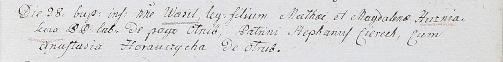

**Гузняк Василь Матеев (Huzniak Wasil)**

28 ноября 1802 г -- крещение (НИАБ 937-4-32, лист 8, №43/1802-р).

**НИАБ 937-4-32:** Лист 8. **Метрическая запись №43/1802-р.**

{width="6.496527777777778in"
height="0.8180555555555555in"}

Дедиловичский костел Наисвятейшего Сердца Иисуса. 28 ноября 1802 года.
Метрическая запись о крещении.

Huzniak Wasil -- сын крестьян с деревни Отруб.

Huzniak Mathey -- отец.

Huzniakowa Magdalena -- мать.

Cierech Stephan -- крестный отец.

Horauczycha Anastasia -- крестная мать, с деревни Отруб.

Linhart Hyacinthus -- ксёндз.
