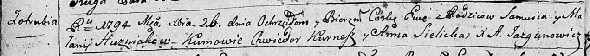
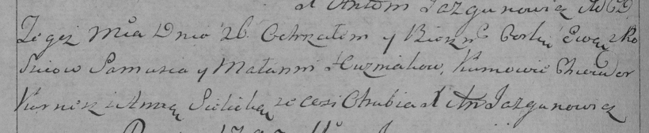
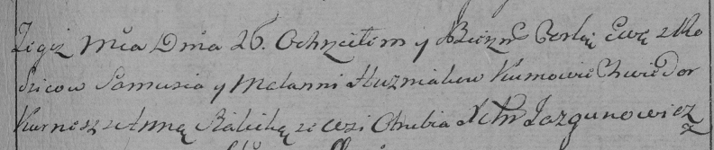

**Гузняк Ева Самусева (Huzniakowna Ewa)**

26 декабря 1794 г -- крещение дочери Евы (НИАБ 136-13-894, лист 23об,
№62/1794-р (ориг)), (РГИА 823-2-18, лист 251об, №43/1794-р (коп)), (РГИА
823-2-18, лист 252, №9/1795-р (коп)).

**НИАБ 136-13-894:** Лист 23об. **Метрическая запись №62/1794-р
(ориг).**

Дедиловичская Покровская церковь. 26 декабря 1794 года. Метрическая
запись о крещении.

Huzniakowna Ewa -- дочь родителей с деревни Отруб.

Huzniak Samuś -- отец.

Huzniakowa Małanija -- мать.

Kurnesz Chwiedor - кум.

Sielicka Anna - кума.

Jazgunowicz Antoni -- ксёндз.

**РГИА 823-2-18:** Лист 251об. **Метрическая запись №43/1794-р (коп).**

Дедиловичская Покровская церковь. 26 декабря 1794 года. Метрическая
запись о крещении.

Huzniakowna Ewa -- дочь родителей с деревни Отруб.

Huzniak Samuś -- отец.

Huznakowa Małannia -- мать.

Kurnesz Chwiedor -- кум.

Sielicka Anna -- кума.

Jazgunowicz Antoni -- ксёндз.

**РГИА 823-2-18:** Лист 252. **Метрическая запись №9/1795-р (коп).**

Дедиловичская Покровская церковь. 26 апреля 1795 года. Метрическая
запись о крещении.

Huzniakowna Ewa -- дочь родителей с деревни Отруб.

Huzniak Samuś -- отец.

Huzniakowa Mełania -- мать.

Kurnesz Chwiedor -- кум.

Sialicka Anna -- кума.

Jazgunowicz Antoni -- ксёндз.
