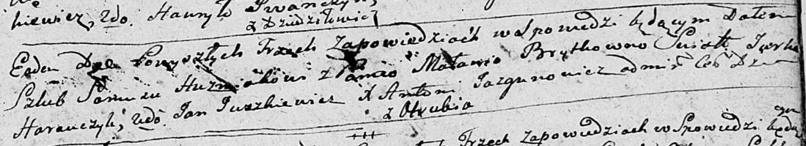
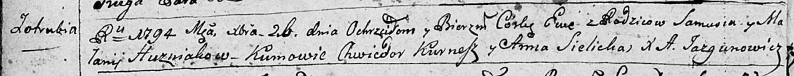
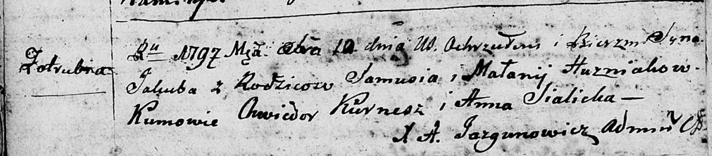
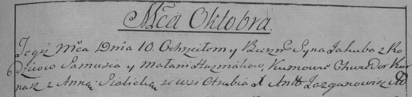

**Гузняк (Брытко) Малания (Huzniakowa Małanija z Brytkow)**

10 ноября 1790 г -- венчание с Самусем Гузняком с деревни Отруб (НИАБ
136-13-894, лист 69, №15/1790-б (ориг)).

26 декабря 1794 г -- крещение дочери Евы (НИАБ 136-13-894, лист 23об,
№62/1794-р (ориг)), (РГИА 823-2-18, лист 251об, №43/1794-р (коп)), (РГИА
823-2-18, лист 252, №9/1795-р (коп)).

10 октября 1797 г -- крещение сына Якуба (НИАБ 136-13-894, лист 34об,
№59/1797-р (ориг)), (РГИА 823-2-18, лист 260об, №39/1797-р (коп)).

**НИАБ 136-13-894:** Лист 69. **Метрическая запись №15/1790-б (ориг).**

Дедиловичская Покровская церковь. 10 ноября 1790 года. Метрическая
запись о венчании.

Huzniak Samuś -- жених, с деревни Отруб.

Brytkowna Malania -- невеста.

Harauczyk Jurka -- свидетель.

Juszkiewicz Jan -- свидетель.

Jazgunowicz Antoni -- ксёндз.

**НИАБ 136-13-894:** Лист 23об. **Метрическая запись №62/1794-р
(ориг).**

Дедиловичская Покровская церковь. 26 декабря 1794 года. Метрическая
запись о крещении.

Huzniakowna Ewa -- дочь родителей с деревни Отруб.

Huzniak Samuś -- отец.

Huzniakowa Małanija -- мать.

Kurnesz Chwiedor - кум.

Sielicka Anna - кума.

Jazgunowicz Antoni -- ксёндз.

**РГИА 823-2-18:** Лист 251об. **Метрическая запись №43/1794-р (коп).**

Дедиловичская Покровская церковь. 26 декабря 1794 года. Метрическая
запись о крещении.

Huzniakowna Ewa -- дочь родителей с деревни Отруб.

Huzniak Samuś -- отец.

Huznakowa Małannia -- мать.

Kurnesz Chwiedor -- кум.

Sielicka Anna -- кума.

Jazgunowicz Antoni -- ксёндз.

**РГИА 823-2-18:** Лист 251об. **Метрическая запись №43/1794-р (коп).**

Дедиловичская Покровская церковь. 26 декабря 1794 года. Метрическая
запись о крещении.

Huzniakowna Ewa -- дочь родителей с деревни Отруб.

Huzniak Samuś -- отец.

Huznakowa Małannia -- мать.

Kurnesz Chwiedor -- кум.

Sielicka Anna -- кума.

Jazgunowicz Antoni -- ксёндз.

**НИАБ 136-13-894:** Лист 34об. **Метрическая запись №59/1797-р
(ориг).**

Дедиловичская Покровская церковь. 10 октября 1797 года. Метрическая
запись о крещении.

Huzniak Jakub -- сын родителей с деревни Отруб.

Huzniak Samuś -- отец.

Huzniakowa Małanija -- мать.

Kurnesz Chwiedor - кум.

Sialicka Anna - кума.

Jazgunowicz Antoni -- ксёндз.

**РГИА 823-2-19:** Лист 261. **Метрическая запись №40/1797-р (коп).**

Дедиловичская Покровская церковь. 10 октября 1797 года. Метрическая
запись о крещении.

Huzniak Jakub -- сын родителей с деревни Отруб.

Huzniak Samuś -- отец.

Huzniakowa Małania -- мать.

Kurnasz Chwiedor -- кум.

Sialicka Anna -- кума.

Jazgunowicz Antoni -- ксёндз.
