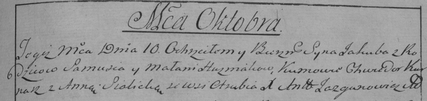

**Гузняк Якуб (Huzniak Jakub)**

10 октября 1797 г -- крещение (НИАБ 136-13-894, лист 34об, №59/1797-р
(ориг)), (РГИА 823-2-18, лист 260об, №39/1797-р (коп)).

**НИАБ 136-13-894:** Лист 34об. **Метрическая запись №59/1797-р
(ориг).**

{width="6.496527777777778in"
height="1.431528871391076in"}

Дедиловичская Покровская церковь. 10 октября 1797 года. Метрическая
запись о крещении.

Huzniak Jakub -- сын родителей с деревни Отруб.

Huzniak Samuś -- отец.

Huzniakowa Małanija -- мать.

Kurnesz Chwiedor - кум.

Sialicka Anna - кума.

Jazgunowicz Antoni -- ксёндз.

**РГИА 823-2-19:** Лист 261. **Метрическая запись №40/1797-р (коп).**

{width="6.496527777777778in"
height="1.5354166666666667in"}

Дедиловичская Покровская церковь. 10 октября 1797 года. Метрическая
запись о крещении.

Huzniak Jakub -- сын родителей с деревни Отруб.

Huzniak Samuś -- отец.

Huzniakowa Małania -- мать.

Kurnasz Chwiedor -- кум.

Sialicka Anna -- кума.

Jazgunowicz Antoni -- ксёндз.
