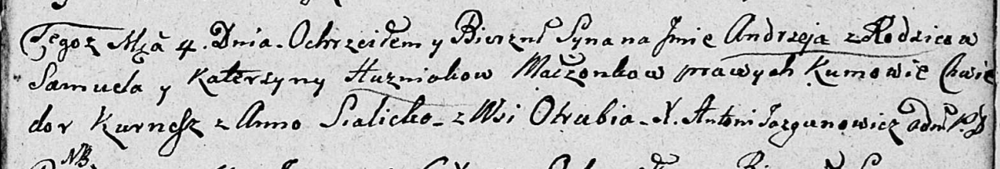

**Гузняк Андрей Самуэлев (Huzniak Andrzey)**

4 декабря 1807 г -- крещение (НИАБ 136-13-894, лист 64, №49/1807-р
(ориг)).

**НИАБ 136-13-894:** Лист 64. **Метрическая запись №49/1807-р (ориг).**

Дедиловичская Покровская церковь. 4 декабря 1807 года. Метрическая
запись о крещении.

Husniak Andrzey -- сын родителей с деревни Отруб.

Husniak Samuel -- отец.

Husniakowa Katerzyna -- мать.

Kurnesz Chwiedor -- кум.

Sialicka Anna -- кума.

Jazgunowicz Antoni -- ксёндз.
