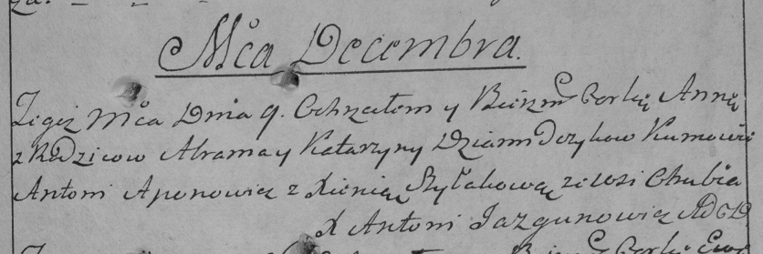

**Демидчик Аврам (Dziamidczyk Awram)**

9 декабря 1787 -- крещение дочери Анны (НИАБ 136-13-894, лист 3,
№63/1787-р (ориг)), (РГИА 823-2-18, лист 235, №33/1787-р (коп)).

**НИАБ 136-13-894:** Лист 3. **Метрическая запись №63/1787-р (ориг).**

{width="6.496527777777778in"
height="0.7797976815398076in"}

Дедиловичская Покровская церковь. 9 декабря 1787 года. Метрическая
запись о крещении.

Dziamidczykowna Anna -- дочь родителей с деревни Отруб.

Dziamidczyk Awram -- отец.

Dziamidczykowa Katerzyna -- мать.

Apanowicz Antoni - кум.

Szyłakowa Xienia - кума.

Jazgunowicz Antoni -- ксёндз.

**РГИА 823-2-18:** Лист 235. **Метрическая запись №33/1787-р (коп).**

{width="6.496527777777778in"
height="2.1680555555555556in"}

Дедиловичская Покровская церковь. 9 декабря 1787 года. Метрическая
запись о крещении.

Dziamidczykowna Anna -- дочь родителей с деревни Отруб.

Dziamidczyk Abram -- отец.

Dziamidczykowa Katarzyna -- мать.

Aponowicz Anton -- кум.

Szyłakowa Xienia - кума.

Jazgunowicz Antoni -- ксёндз.
