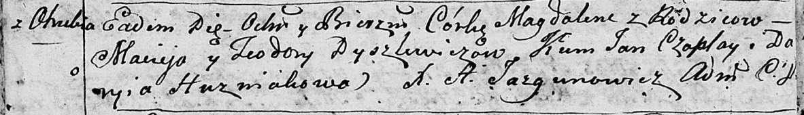

**Дышлевич Магдалена Мацеева (Dyszlewiczowna Magdalena)**

24 июля 1795 г -- крещение (НИАБ 136-13-894, лист 24об, №23/1795-р
(ориг)).

**НИАБ 136-13-894:** Лист 24об. **Метрическая запись №23/1795-р
(ориг).**

{width="6.496527777777778in"
height="0.9346850393700787in"}

Дедиловичская Покровская церковь. 24 июля 1795 года. Метрическая запись
о крещении.

Dyszlewiczowna Magdalena -- дочь родителей с деревни Отруб.

Dyszlewicz Maciey -- отец.

Dyszlewiczowa Teodora -- мать.

Czaplay Jan - кум.

Huzniakowa Daryia - кума.

Jazgunowicz Antoni -- ксёндз.
