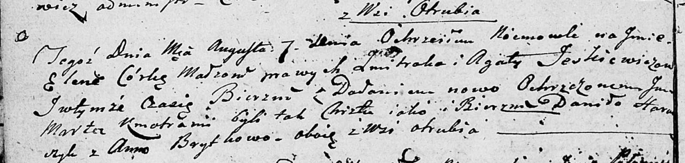

**Еськевич Елена Змитрокова (Jeskiewiczowna Elena Marta)**

7 августа 1804 г -- крещение (НИАБ 136-13-894, лист 54об, №29/1804-р
(ориг)).

**НИАБ 136-13-894:** Лист 54об. **Метрическая запись №29/1804-р
(ориг).**

Дедиловичская Покровская церковь. 7 августа 1804 года. Метрическая
запись о крещении.

Jeskewiczowna Elena Marta -- дочь родителей с деревни Отруб.

Jeskewicz Zmitrok -- отец.

Jeskewiczowa Agata -- мать.

Harawczyk Daniło -- кум, с деревни Отруб.

Brytkowa Anna -- кума, с деревни Отруб.

Jazgunowicz Antoni -- ксёндз.
