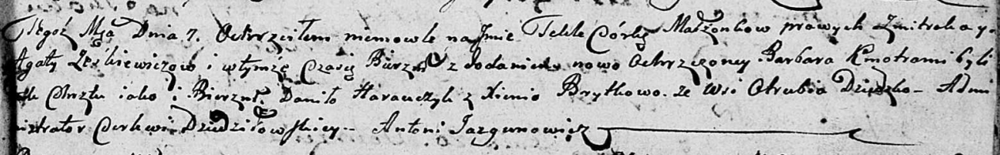
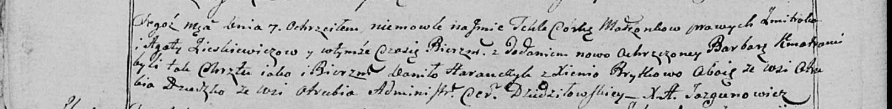

**Еськевич Текля Змитрокова (Jeśkiewiczowna Tekla Barbara)**

7 октября 1800 г -- крещение (НИАБ 136-13-894, лист 42, №29/1800-р
(ориг), НИАБ 136-13-949, лист 103об, №32/1800-р (коп)).

**НИАБ 136-13-894:** Лист 42. **Метрическая запись №29/1800-р (ориг).**

Дедиловичская Покровская церковь. 7 октября 1800 года. Метрическая
запись о крещении.

Jeśkiewiczowna Tekla Barbara -- дочь родителей с деревни Отруб.

Jeśkiewicz Zmitrok -- отец.

Jeśkiewiczowa Agata -- мать.

Harawczyk Daniła -- кум.

Brytkowa Xienia -- кума.

Jazgunowicz Antoni -- ксёндз.

**НИАБ 136-13-949:** Лист 103об. **Метрическая запись №32/1800-р
(коп).**

(См. тж.: НИАБ 136-13-894, лист 42, №29/1800-р (ориг))

Дедиловичская Покровская церковь. 7 октября 1800 года. Метрическая
запись о крещении.

Zieskiewiczowna \[Jeśkiewiczowna\] Tekla Barbara -- дочь родителей с
деревни Отруб.

Zieskiewicz \[Jeśkiewicz\] Zmitrok -- отец.

Zieskiewiczowa \[Jeśkiewiczowa\] Agata -- мать.

Harauczyk Daniło -- кум, с деревни Отруб.

Brytkowa Xienia - кума, с деревни Отруб.

Jazgunowicz Antoni -- ксёндз.
