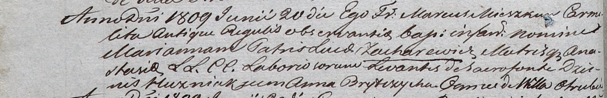
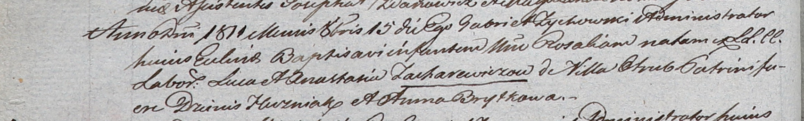

**Захаревич Лука (Zacharewicz Łuca)**

20 июня 1809 г -- крещение дочери Марьяны (НИАБ 937-4-32, лист 19об,
№18/1809-р).

15 октября 1811 г -- крещение дочери Розалии (НИАБ 937-4-32, лист 23об,
№16/1811-р).

**НИАБ 937-4-32:** Лист 19об. **Метрическая запись №18/1809-р.**

Дедиловичский костел Наисвятейшего Сердца Иисуса. 20 июня 1809 года.
Метрическая запись о крещении.

Zacharewiczowna Marianna -- дочь крестьян с деревни Отруб.

Zacharewicz Łuca -- отец.

Zacharewiczowa Anastasia -- мать.

Huzniak Dzienis -- крестный отец, с деревни Отруб.

Brytczycha Anna -- крестная мать, с деревни Отруб.

Miszkun Marcus -- ксёндз.

**НИАБ 937-4-32:** Лист 23об. **Метрическая запись №16/1811-р.**

Дедиловичский костел Наисвятейшего Сердца Иисуса. 15 октября 1811 года.
Метрическая запись о крещении.

Zacharewiczowna Rosalia -- дочь крестьян с деревни Отруб.

Zacharewicz Łuca -- отец.

Zacharewiczowa Anastasia -- мать.

Huzniak Dzienis -- крестный отец.

Brytkowa Anna -- крестная мать.

Zychowski Gabriel -- ксёндз.
