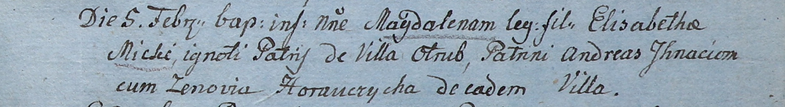

**Игнатёнок Андрей (Jhnacionek Andreas)**

5 февраля 1805 г -- крестный отец незаконнорожденной Магдалены, дочери
Элизабеты Мицки с деревни Отруб (НИАБ 937-4-32, лист 11, №6/1805-р).

**НИАБ 136-13-894:** Лист 11. **Метрическая запись №6/1805-р.**

Дедиловичский костел Наисвятейшего Сердца Иисуса. 5 февраля 1805 года.
Метрическая запись о крещении.

Micka Magdalena -- незаконнорожденная дочь.

Micka Elizabetha -- мать, с деревни Отруб.

Jhnacionek Andreas -- крестный отец, с деревни Отруб.

Horauczycha Zenovia -- крестная мать, с деревни Отруб.

Linhart Hiacinthus -- ксёндз.
