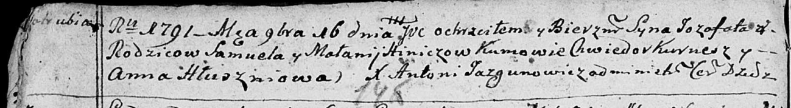
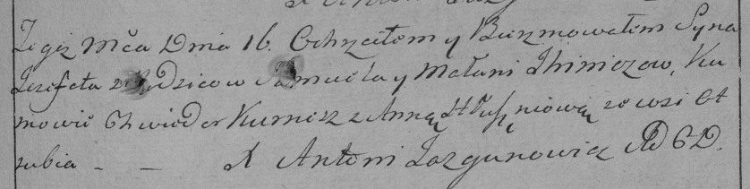

**Илинич Иозафат Самуэлев (Hinicz, Jhinicz Jozafat)**

16 ноября 1791 г -- крещение (НИАБ 136-13-894, лист 14об, №57/1791-р
(ориг)), (РГИА 823-2-18, лист 243, №31/1791-р (коп)).

**НИАБ 136-13-894:** Лист 14-об. **Метрическая запись №57/1791-р
(ориг).**

Дедиловичская Покровская церковь. 16 ноября 1791 года. Метрическая
запись о крещении.

Hinicz Jozafat -- сын родителей с деревни Отруб.

Hinicz Samuel -- отец.

Hiniczowa Małanija -- мать.

Kurnesz Chwiedor - кум.

Hłuszniowa Anna - кума.

Jazgunowicz Antoni -- ксёндз.

**РГИА 823-2-18:** Лист 243. **Метрическая запись №31/1791-р (коп).**

Дедиловичская Покровская церковь. 16 ноября 1791 года. Метрическая
запись о крещении.

Jhinicz \[Hinicz\] Jezefat -- сын родителей с деревни Отруб.

Jhinicz \[Hinicz\] Samiel -- отец.

Jhinicz \[Hinicz\] Małania -- мать.

Kurnesz Chwiedor -- кум.

Hłuszniowa Anna - кума.

Jazgunowicz Antoni -- ксёндз.
