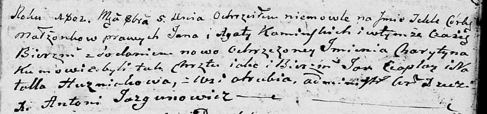

**Каминский Ян (Kaminski Jan)**

5 октября 1802 г -- крещение дочери Текли Харытыны (НИАБ 136-13-894,
лист 48, №34/1802-р (ориг)).

**НИАБ 136-13-894:** Лист 48. **Метрическая запись №34/1802-р (ориг).**

{width="6.496527777777778in"
height="1.5247298775153106in"}

Дедиловичская Покровская церковь. 5 октября 1802 года. Метрическая
запись о крещении.

Kaminska Tekla Charytyna -- дочь родителей с деревни Отруб.

Kaminski Jan -- отец.

Kaminska Agata -- мать.

Czaplay Jan -- кум.

Huzniakowa Natalla -- кума.

Jazgunowicz Antoni -- ксёндз.
