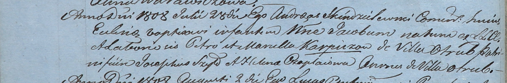

**Карпич Петр (Karpicz Petro)**

28 июля 1808 г -- крещение сына Якуба (НИАБ 937-4-32, лист 18об,
№21/1808-р).

**НИАБ 937-4-32:** Лист 18об. **Метрическая запись №21/1808-р.**

Дедиловичский костел Наисвятейшего Сердца Иисуса. 28 июля 1808 года.
Метрическая запись о крещении.

Karpicz Jakub -- сын крестьян с деревни Отруб.

Karpicz Petro -- отец.

Karpiczowa Marcella -- мать.

Szyło Joseph -- крестный отец, с деревни Отруб.

Czaplaiowa Helena -- крестная мать, с деревни Отруб.

Scindzelewski Andreas -- ксёндз, комендант Дедиловичский.
