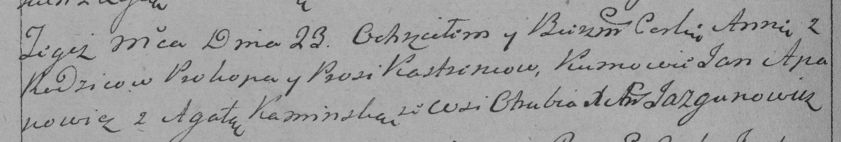

**Кастренец Анна Прокопова (Kastrencowna Anna)**

23 сентября 1789 г -- крещение (НИАБ 136-13-894, лист 7об, №48/1789-р
(ориг)), (РГИА 823-2-18, лист 238об, №21/1789-р (коп)).

**НИАБ 136-13-894:** Лист 7об. **Метрическая запись №48/1789-р (ориг).**

{width="6.496527777777778in"
height="0.7268274278215223in"}

Дедиловичская Покровская церковь. 23 сентября 1789 года. Метрическая
запись о крещении.

Kastrencowna Anna -- дочь родителей с деревни Отруб.

Kastrenec Prokop -- отец.

Kastrencowa Prosyia -- мать.

Apanowicz Jan - кум.

Kaminska Agata - кума.

Jazgunowicz Antoni -- ксёндз.

**РГИА 823-2-18:** Лист 238об. **Метрическая запись №21/1789-р (коп).**

{width="6.496527777777778in"
height="1.0972222222222223in"}

Дедиловичская Покровская церковь. 23 сентября 1789 года. Метрическая
запись о крещении.

Kastrencowna Anna -- дочь родителей с деревни Отруб.

Kastreniec Prokop -- отец.

Kastrencowa Prosia -- мать.

Apanowicz Jan -- кум.

Kaminska Agata - кума.

Jazgunowicz Antoni -- ксёндз.
