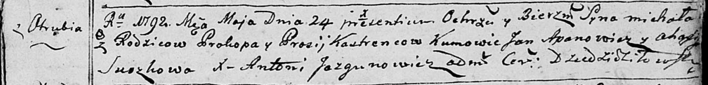

**Кастренец Михал Прокопов (Kostreniec Michał)**

24 мая 1792 г -- крещение (НИАБ 136-13-894, лист 16, №28/1792-р (ориг)).

**НИАБ 136-13-894:** Лист 16. **Метрическая запись №28/1792-р (ориг).**

Дедиловичская Покровская церковь. 24 мая 1792 года. Метрическая запись о
крещении.

Kostreniec Michał -- сын родителей с деревни Отруб.

Kostreniec Prokop -- отец.

Kostrencowa Prosia -- мать.

Apanowicz Jan - кум.

Suszkowa Ahafija - кума.

Jazgunowicz Antoni -- ксёндз.
