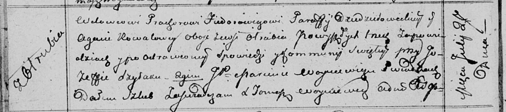

**Федорович (Коваль) Агата (Fiedorowiczowa (Kowalowa) Agata)**

27 июля 1813 г -- венчание с вдовцом Прохором Федоровичем с деревни
Отруб (НИАБ 136-13-920, лист 19об, №11/1813-б (ориг)).

**НИАБ 136-13-920:** Лист 19об. **Метрическая запись №11/1813-б
(ориг).**

{width="6.496527777777778in"
height="1.454326334208224in"}

Осовская Покровская церковь. 27 июля 1813 года. Запись о венчании.

Fiedorowicz Prochor -- жених, вдовец, парафии Дедиловичской
католической, с деревни Отруб.

Kowalowa Agata -- невеста, с деревни Отруб.

Szyłak Jozef -- свидетель.

Woyniewicz Marcin, JP -- свидетель, шляхтич.

Woyniewicz Tomasz -- ксёндз.
