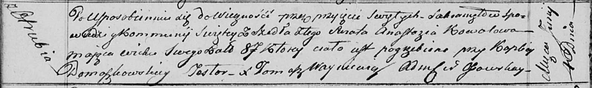

**Коваль Анастасия (Kowalowa Anastazia)**

1 июня 1817 г -- отпевание, умерла в возрасте 87 лет (родилась около
1730 г) (НИАБ 136-13-919, лист 30об, №11/1817-у (ориг)).

**НИАБ 136-13-919:** Лист 30об. **Метрическая запись №11/1817-у
(ориг).**

Осовская униатская церковь. 1 июня 1817 года. Метрическая запись об
отпевании.

Kowalowa Anastazia -- умершая, 87 лет, с деревни Отруб, похоронена при
каплице Домашковичской.

Woyniewicz Tomasz -- ксёндз.
