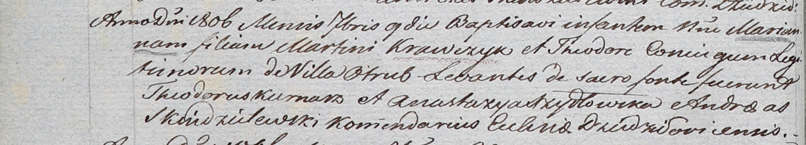

**Кравчик Мартин (Krawczyk Martin)**

9 сентября 1806 г -- крещение дочери Марьяны (НИАБ 937-4-32, лист 13об,
№16/1806-р).

**НИАБ 937-4-32:** Лист 13об. **Метрическая запись №16/1806-р.**

{width="6.496527777777778in"
height="1.176388888888889in"}

Дедиловичский костел Наисвятейшего Сердца Иисуса. 9 сентября 1806 года.
Метрическая запись о крещении.

Krawczykowna Marianna -- дочь родителей с деревни Отруб.

Krawczyk Martin -- отец.

Krawczykowa Theodora -- мать.

Kurnasz Theodor -- крестный отец.

Szydłowska Anastazya -- крестная мать.

Skindzelewski Andreas -- ксёндз, комендант Дедиловичский.
