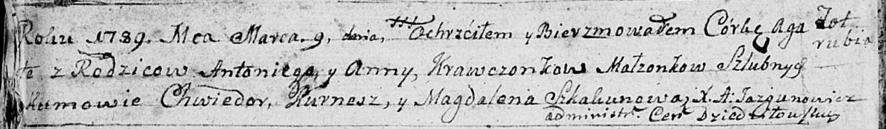
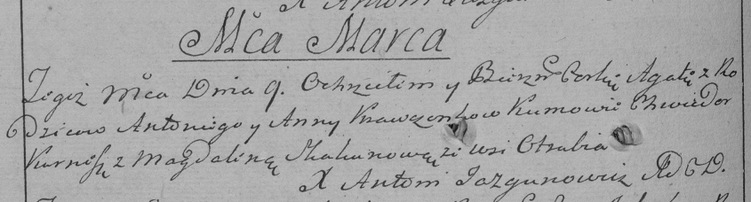

**Кравчёнок Агата Антонова (Krawczonkowna Agata)**

9 марта 1788 г -- крещение (НИАБ 136-13-894, лист 6об, №15/1789-р
(ориг)), (РГИА 823-2-18, лист 237об, №8/1789-р (коп)).

**НИАБ 136-13-894:** Лист 6об. **Метрическая запись №15/1789-р (ориг).**

Дедиловичская Покровская церковь. 9 марта 1789 года. Метрическая запись
о крещении.

Krawczonkowna Agata -- дочь родителей с деревни Отруб.

Krawczonek Antonij -- отец.

Krawczonkowa Anna -- мать.

Kurnesz Chwiedor - кум.

Skakunowa Magdalena - кума.

Jazgunowicz Antoni -- ксёндз.

Лист 237об. **Метрическая запись №8/1789-р (коп).**

Дедиловичская Покровская церковь. 9 марта 1789 года. Метрическая запись
о крещении.

Krawczonkowna Agata -- дочь родителей с деревни Отруб.

Krawczonek Antoni -- отец.

Krawczonkowa Anna -- мать.

Kurnesz Chwiedor -- кум.

Skakunowa Magdalena - кума.

Jazgunowicz Antoni -- ксёндз.
