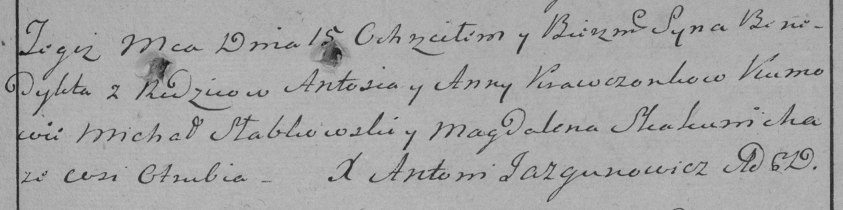

**Кравчёнок Бенедыкт Антонов (Krawczonek Benedykt)**

15 марта 1786 г -- крещение (РГИА 823-2-18, лист 231, №9/1786-р (коп)).

**РГИА 823-2-18:** Лист 231. **Метрическая запись №9/1786-р (коп).**

Дедиловичская Покровская церковь. 15 марта 1786 года. Метрическая запись
о крещении.

Krawczonak Benedykt -- сын родителей с деревни Отруб.

Krawczonak Antoś -- отец.

Krawczonkowa Anna -- мать.

Słabkowski Michał -- кум.

Skakunicha Magdalena - кума.

Jazgunowicz Antoni -- ксёндз.
