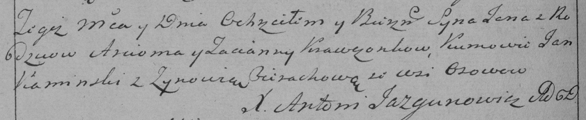

**Кравчонок Арцём (Krawczonek Arciom, Arćiom)**

28 ноября 1787 г -- крещение сына Якуба (НИАБ 136-13-894, лист 3,
№62/1787-р (ориг)).

16 сентября 1790 г -- крещение сына Яна (НИАБ 136-13-894, лист 11,
№62/1790-р (ориг)), (РГИА 823-2-18, лист 240об, №26/1790-р (коп)).

**НИАБ 136-13-894:** Лист 3. **Метрическая запись №62/1787-р (ориг).**

{width="6.496527777777778in"
height="0.7911964129483815in"}

Дедиловичская Покровская церковь. 28 ноября 1787 года. Метрическая
запись о крещении.

Krawczonek Jakub -- сын родителей с деревни Отруб.

Krawczonek Arciom -- отец.

Krawczonkowa Taciana -- мать.

Kaminski Jan - кум.

Cierachowa Zynowija - кума.

Jazgunowicz Antoni -- ксёндз.

**НИАБ 136-13-894:** Лист 11. **Метрическая запись №62/1790-р (ориг).**

{width="6.496527777777778in"
height="0.8502012248468941in"}

Дедиловичская Покровская церковь. 16 сентября 1790 года. Метрическая
запись о крещении.

Krawczonak Jan -- сын родителей с деревни Отруб.

Krawczonak Arćiom -- отец.

Krawczonkowa Taciana -- мать.

Kaminski Jan - кум.

Cierachowa Zynowija - кума.

Jazgunowicz Antoni -- ксёндз.

**РГИА 823-2-18:** Лист 240об. **Метрическая запись №26/1790-р (коп).**

{width="6.496527777777778in"
height="1.336111111111111in"}

Дедиловичская Покровская церковь. 16 сентября 1790 года. Метрическая
запись о крещении.

Krawczonek Jan -- сын родителей с деревни Осово \[Отруб\].

Krawczonek Arciom -- отец.

Krawczonkowa Tacianna -- мать.

Kaminski Jan -- кум.

Cierachowa Zynowia - кума.

Jazgunowicz Antoni -- ксёндз.
