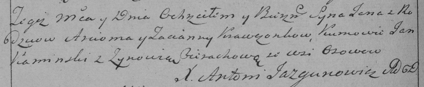

**Кравчонок Татьяна (Krawczonkowa Taciana)**

28 ноября 1787 г -- крещение сына Якуба (НИАБ 136-13-894, лист 3,
№62/1787-р (ориг)).

16 сентября 1790 г -- крещение сына Яна (НИАБ 136-13-894, лист 11,
№62/1790-р (ориг)), (РГИА 823-2-18, лист 240об, №26/1790-р (коп)).

30 июля 1794 г -- вдова, венчание с молодым Василём Синяком с деревни
Отруб (НИАБ 136-13-920, лист 1, №5/1794-б (ориг)).

**НИАБ 136-13-894:** Лист 3. **Метрическая запись №62/1787-р (ориг).**

Дедиловичская Покровская церковь. 28 ноября 1787 года. Метрическая
запись о крещении.

Krawczonek Jakub -- сын родителей с деревни Отруб.

Krawczonek Arciom -- отец.

Krawczonkowa Taciana -- мать.

Kaminski Jan - кум.

Cierachowa Zynowija - кума.

Jazgunowicz Antoni -- ксёндз.

**НИАБ 136-13-894:** Лист 11. **Метрическая запись №62/1790-р (ориг).**

Дедиловичская Покровская церковь. 16 сентября 1790 года. Метрическая
запись о крещении.

Krawczonak Jan -- сын родителей с деревни Отруб.

Krawczonak Arćiom -- отец.

Krawczonkowa Taciana -- мать.

Kaminski Jan - кум.

Cierachowa Zynowija - кума.

Jazgunowicz Antoni -- ксёндз.

**РГИА 823-2-18:** Лист 240об. **Метрическая запись №26/1790-р (коп).**

Дедиловичская Покровская церковь. 16 сентября 1790 года. Метрическая
запись о крещении.

Krawczonek Jan -- сын родителей с деревни Осово \[Отруб\].

Krawczonek Arciom -- отец.

Krawczonkowa Tacianna -- мать.

Kaminski Jan -- кум.

Cierachowa Zynowia - кума.

Jazgunowicz Antoni -- ксёндз.

**НИАБ 136-13-920:** Лист 1. **Метрическая запись №5/1794-б (ориг).**

Дедиловичская Покровская церковь. 30 июля 1794 года. Метрическая запись
о венчании.

Siniak Wasil -- жених, молодой, деревня Отруб.

Krawczonkowa Taciana -- невеста, вдова, деревня Отруб.

Huzniak Dzianis -- свидетель.

Mazur? Tomasz -- свидетель.

Jazgunowicz Antoni -- ксёндз.
