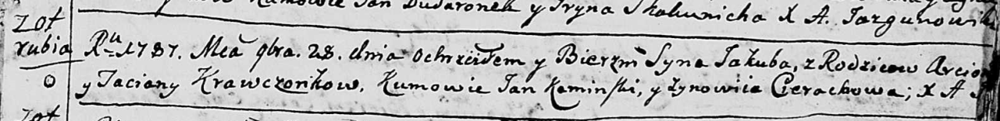

**Кравчёнок Якуб Арцёмов (Krawczonek Jakub)**

28 ноября 1787 г -- крещение (НИАБ 136-13-894, лист 3, №62/1787-р
(ориг)).

**НИАБ 136-13-894:** Лист 3. **Метрическая запись №62/1787-р (ориг).**

{width="6.496527777777778in"
height="0.7911964129483815in"}

Дедиловичская Покровская церковь. 28 ноября 1787 года. Метрическая
запись о крещении.

Krawczonek Jakub -- сын родителей с деревни Отруб.

Krawczonek Arciom -- отец.

Krawczonkowa Taciana -- мать.

Kaminski Jan - кум.

Cierachowa Zynowija - кума.

Jazgunowicz Antoni -- ксёндз.
