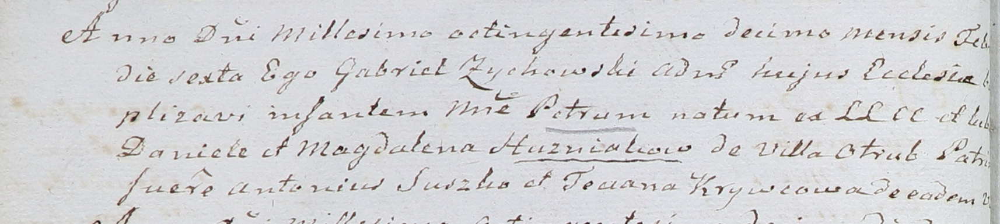

**Кривец Татьяна (Krywcowa Taciana)**

10 января 1806 г -- крестная мать Стефана, сына Данилы и Натальи
Гузняков с деревни Отруб (НИАБ 937-4-32, лист 13, №2/1806-р).

6 февраля 1810 г -- крестная мать Петра, сына Данилы и Магдалены
Гузняков с деревни Отруб (НИАБ 937-4-32, лист 21об, №8/1810-р).

**НИАБ 937-4-32:** Лист 13. **Метрическая запись №2/1806-р.**

{width="6.496527777777778in"
height="0.8354166666666667in"}

Дедиловичский костел Наисвятейшего Сердца Иисуса. 10 января 1806 года.
Метрическая запись о крещении.

Huzniak Stephan -- сын родителей с деревни Отруб.

Huzniak Daniel -- отец.

Huzniakowa Natalia z Okurkow -- мать.

Suszko Antoni -- крестный отец.

Krywcowa Taciana -- крестная мать, с деревни Отруб.

Linhart Hiacinthus -- ксёндз.

**НИАБ 937-4-32:** Лист 21об. **Метрическая запись №8/1810-р.**

{width="6.496527777777778in"
height="1.4590277777777778in"}

Дедиловичский костел Наисвятейшего Сердца Иисуса. 6 февраля 1810 года.
Метрическая запись о крещении.

Huzniak Petrus -- сын крестьян с деревни Отруб.

Huzniak Daniel -- отец.

Huzniakowa Magdalena -- мать.

Suszko Antoni -- крестный отец.

Krywcowa Teciana -- крестная мать, с деревни Отруб.

Zychowski Gabriel -- ксёндз.
