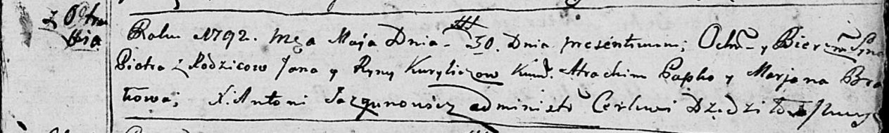
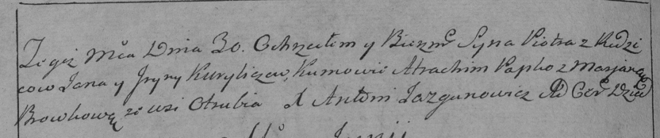

**Курилич Рына (Kuryliczowa Ryna)**

30 мая 1792 г -- крещение сына Петра (НИАБ 136-13-894, лист 16,
№30/1792-р (ориг)), (РГИА 823-2-18, лист 244, №12/1792-р (коп)).

**НИАБ 136-13-894:** Лист 16. **Метрическая запись №30/1792-р (ориг).**

Дедиловичская Покровская церковь. 30 мая 1792 года. Метрическая запись о
крещении.

Kurylicz Piotr -- сын родителей с деревни Отруб.

Kurylicz Jan -- отец.

Kuryliczowa Ryna -- мать.

Papko Atrachim - кум.

Browkowa Marjana - кума.

Jazgunowicz Antoni -- ксёндз.

**РГИА 823-2-18:** Лист 244об. **Метрическая запись №12/1792-р (коп).**

Дедиловичская Покровская церковь. 30 мая 1792 года. Метрическая запись о
крещении.

Kurylicz Piotr -- сын родителей с деревни Отруб.

Kurylicz Jan -- отец.

Kuryliczowa Jryna -- мать.

Papko Atrachim -- кум.

Browkowa Marjana -- кума.

Jazgunowicz Antoni -- ксёндз.
