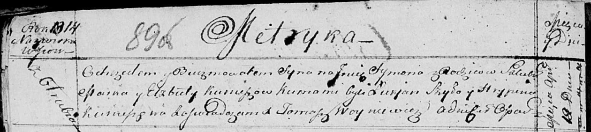

**Курнеш Елисавета (Kurneszowa Elżbieta)**

18 апреля 1814 г -- крещение сына Сымона (НИАБ 136-13-894, лист 89об,
№26/1814-р (ориг)).

**НИАБ 136-13-894:** Лист 89об. **Метрическая запись №26/1814-р
(ориг).**

Осовская Покровская церковь. 18 апреля 1814 года. Метрическая запись о
крещении.

Kurnesz Symon -- сын родителей с деревни Отруб.

Kurnesz Mark -- отец.

Kurneszowa Elżbieta -- мать.

Szyło Łukjan -- кум.

Kurneszowa Hrypina -- кума.

Woyniewicz Tomasz -- ксёндз.
