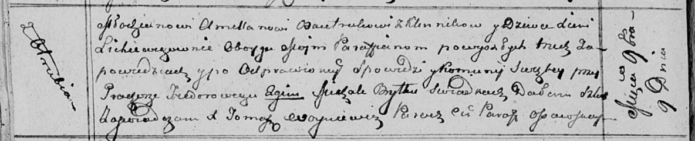

**Бавтрук (в девичестве Лихевич) Ксеня (Bautrukowa Xienia z
Lichiewiczow)**

9 ноября 1813 г -- венчание с молодым Амилляном Бавтруком с деревни
Клинники (НИАБ 136-13-920, лист 20об, №25/1813-б (ориг)).

**НИАБ 136-13-920:** Лист 20об. **Метрическая запись №25/1813-б
(ориг).**

Осовская Покровская церковь. 9 ноября 1813 года. Запись о венчании.

Bautruk Amellan -- жених, молодой, парафии Осовской, с деревни Клинники.

Lichiewiczowna Xienia -- невеста, девка, парафии Осовской, с деревни
Отруб.

Fiedorowicz Prochor -- свидетель.

Brytka Michał -- свидетель.

Woyniewicz Tomasz -- ксёндз.
