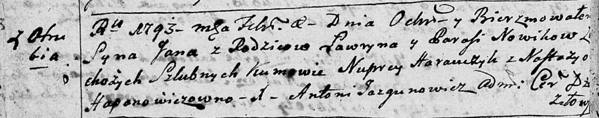

**Новик Лаврын (Nowik Ławryn)**

10 февраля 1793 года г -- крещение сына Яна (НИАБ 136-13-894, лист 18об,
№17/1793-р (ориг)).

**НИАБ 136-13-894:** Лист 18-об. **Метрическая запись №17/1793-р
(ориг).**

{width="6.496527777777778in"
height="1.2806660104986876in"}

Дедиловичская Покровская церковь. 10 февраля 1793 года. Метрическая
запись о крещении.

Nowik Jan -- сын родителей с деревни Отруб.

Nowik Ławryn -- отец.

Nowikowa Parasia -- мать.

Harauczyk Nuprey - кум.

Hapanowiczowna Nastazya - кума.

Jazgunowicz Antoni -- ксёндз.
