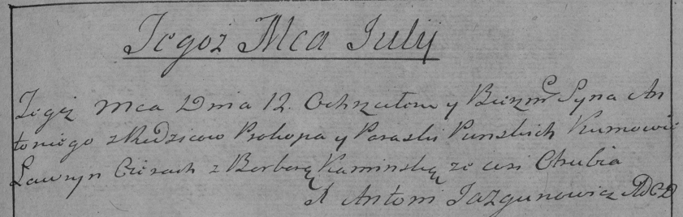

**Пунский Прокоп (Punski Prokop)**

12 июля 1786 г -- крещение сына Антона (РГИА 832-2-18, лист 232,
№17/1786-р (коп)).

**РГИА 823-2-18:** Лист 232. **Метрическая запись №17/1786-р (коп).**

{width="6.496527777777778in"
height="2.0701388888888888in"}

Дедиловичская Покровская церковь. 12 июля 1786 года. Метрическая запись
о крещении.

Punski Antoni -- сын родителей с деревни Отруб.

Punski Prokop -- отец.

Punska Paraska -- мать.

Cierach Ławryn -- кум.

Kaminska Barbara - кума.

Jazgunowicz Antoni -- ксёндз.
