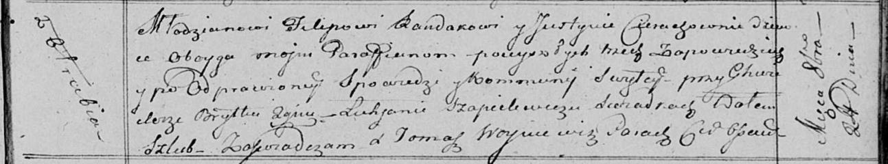

**Рандак (в девичестве Церах) Юстына (Randakowa Justyna z Cierachow)**

24 октября 1815 г -- венчание с молодым Филипом Рандаком с деревни Отруб
(НИАБ 136-13-920, лист 22, №4/1815-б (коп)).

**НИАБ 136-13-920:** Лист 22. **Метрическая запись №4/1815-б (ориг).**

Осовская Покровская церковь. 24 октября 1815 года. Запись о венчании.

Randak Filip -- жених, молодой, парафии Осовской, с деревни Отруб.

Cierachowna Justyna -- невеста, девка, парафии Осовской.

Brytka Chwiedor -- свидетель.

Szapielewicz Łukjan -- свидетель.

Woyniewicz Tomasz -- ксёндз.
