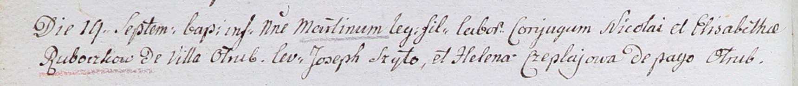

**Рубочка Элизабета (Ruboczkowa Elisabetha)**

19 сентября 1802 г -- крещение сына Мартина (НИАБ 937-4-32, лист 7об,
№31/1802-р).

**НИАБ 937-4-32:** Лист 7об. **Метрическая запись №31/1802-р.**

Дедиловичский костел Наисвятейшего Сердца Иисуса. 19 сентября 1802 года.
Метрическая запись о крещении.

Ruboсzko Martin -- сын крестьян с деревни Отруб.

Ruboсzko Nicolay -- отец.

Ruboсzkowa Elisabetha -- мать.

Szyło Joseph -- крестный отец.

Czeplajowa Helena -- крестная мать, с деревни Отруб.

Linhart Hyacinthus -- ксёндз.
