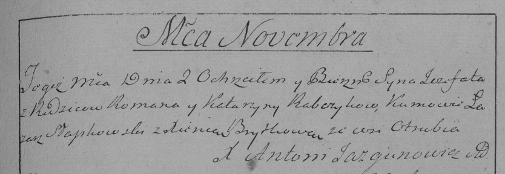

**Рябчик Роман (Rabczyk Roman)**

2 ноября 1796 г -- крещение сына Ёзафата (НИАБ 136-13-894, лист 31,
№93/1796-р (ориг)), (РГИА 823-2-18, лист 258, №57/1796-р (коп)).

**НИАБ 136-13-894:** Лист 31. **Метрическая запись №93/1796-р (ориг).**

Дедиловичская Покровская церковь. 2 ноября 1796 года. Метрическая запись
о крещении.

Rabczyk Jozafat -- сын родителей с деревни Отруб.

Rabczyk Roman -- отец.

Rabczykowa Katerzyna -- мать.

Słabkowski Łazarz -- кум.

Brytkowa Xienia - кума.

Jazgunowicz Antoni -- ксёндз.

**РГИА 823-2-18:** Лист 258. **Метрическая запись №57/1796-р (коп).**

Дедиловичская Покровская церковь. 2 ноября 1796 года. Метрическая запись
о крещении.

Rabczyk Jozefat -- сын родителей с деревни Отруб.

Rabczyk Roman -- отец.

Rabczykowa Katarzyna -- мать.

Słapkowski Łazarz -- кум.

Brytkowa Xienia -- кума.

Jazgunowicz Antoni -- ксёндз.
