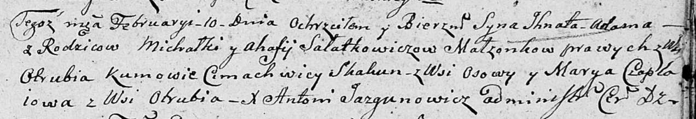

**Саладкевич Игнат Михалков (Sałatkowicz Jhnat Adam)**

10 февраля 1807 г -- крещение (НИАБ 136-13-894, лист 62, №8/1807-р
(ориг)).

**НИАБ 136-13-894:** Лист 62. **Метрическая запись №8/1807-р (ориг).**

Дедиловичская Покровская церковь. 10 февраля 1807 года. Метрическая
запись о крещении.

Sałatkowicz Jhnat Adam -- сын родителей с деревни Отруб.

Sałatkowicz Michałka -- отец.

Sałatkowiczowa Ahafija -- мать.

Skakun Cimachwey -- кум, с деревни Осовo.

Czaplaiowa Marya -- кума, с деревни Отруб.

Jazgunowicz Antoni -- ксёндз.
