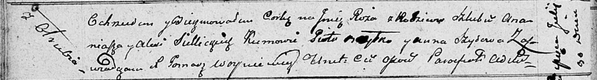

**Селицкая Алеся (Siellicka Alesia)**

30 июля 1811 г -- крещение дочери Ружы (НИАБ 136-13-894, лист 81об,
№401811-р (ориг)).

**НИАБ 136-13-894:** Лист 81об. **Метрическая запись №40/1811-р
(ориг).**

Осовская Покровская церковь. 30 июля 1811 года. Метрическая запись о
крещении.

Siellicka Róża -- дочь родителей с деревни Отруб.

Siellicki Ananiasz -- отец.

Siellicka Alesia -- мать.

Brytka Piotr -- кум.

Szyłowa Anna -- кума.

Woyniewicz Tomasz -- ксёндз.
