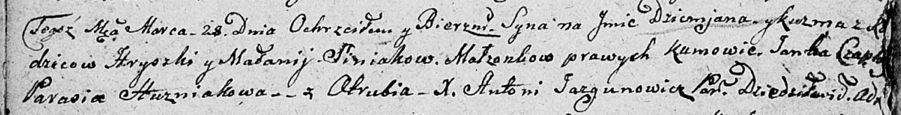

**Синяк Грыгор, Грышка (Siniak Hryszka, Hryhor)**

22 декабря 1791 г -- крещение дочери Настасьи (НИАБ 136-13-894, лист
14об, №69/1791-р (ориг)), (РГИА 823-2-18, лист 243об, №37/1791-р (коп)).

23 ноября 1792 г -- крещение дочери Катерины (НИАБ 136-13-894, лист
17об, №78/1792-р (ориг)).

27 мая 1795 г -- крещение сына Сымона (НИАБ 136-13-894, лист 24,
№13/1795-р (ориг)), (РГИА 823-2-18, лист 252, №10/1795-р (коп)).

26 мая 1797 г -- крещение сына Сымона младшего (НИАБ 136-13-894, лист
33, №31/1797-р (ориг)), (РГИА 823-2-18, лист 259об, №22/1797-р (коп)).

19 июля 1803 г -- крещение сына Ильи Романа (НИАБ 136-13-894, лист 51,
№27/1803-р (ориг)).

16 июля 1805 г -- крещение сына Марка Ильи (НИАБ 136-13-894, лист 57об,
№32/1805-р (ориг)).

28 марта 1807 г -- крещение сына Демьяна Кузьмы (НИАБ 136-13-894, лист
62об, №20/1807-р (ориг)).

20 июня 1809 г -- крещение дочери Юльяны (НИАБ 937-4-32, лист 19об,
№17/1809-р).

30 марта 1811 г -- крещение дочери Евдокии (НИАБ 136-13-894, лист 80об,
№16/1811-р (ориг)).

**НИАБ 136-13-894:** Лист 14-об. **Метрическая запись №69/1791-р
(ориг).**

Дедиловичская Покровская церковь. 22 декабря 1791 года. Метрическая
запись о крещении.

Siniakowna Nastazyja -- дочь родителей с деревни Отруб.

Siniak Hryszka -- отец.

Siniakowa Małanija -- мать.

Czaplay Jan - кум.

Hapanowiczowa Taciana - кума.

Jazgunowicz Antoni -- ксёндз.

**РГИА 823-2-18:** Лист 243об. **Метрическая запись №37/1791-р (коп).**

Дедиловичская Покровская церковь. 22 декабря 1791 года. Метрическая
запись о крещении.

Siniakowna Nastazya -- дочь родителей с деревни Отруб.

Siniak Hryszka -- отец.

Siniakowna Małannija -- мать.

Czaplay Jan -- кум.

Hapanowiczowa Tacianna - кума.

Jazgunowicz Antoni -- ксёндз.

**НИАБ 136-13-894:** Лист 17-об. **Метрическая запись №78/1792-р
(ориг).**

Дедиловичская Покровская церковь. 23 ноября 1792 года. Метрическая
запись о крещении.

Siniakowna Katerzyna -- дочь родителей с деревни Отруб.

Siniak Hryhor -- отец.

Siniakowa Malanija -- мать.

Czaplay Anika - кум.

Apanowiczowa Nastazyia - кума.

Jazgunowicz Antoni -- ксёндз.

**НИАБ 136-13-894:** Лист 24. **Метрическая запись №13/1795-р (ориг).**

Дедиловичская Покровская церковь. 27 мая 1795 года. Метрическая запись о
крещении.

Siniak Symon -- сын родителей с деревни Отруб.

Siniak Hryszka -- отец.

Siniakowa Mełanija -- мать.

Czaplay Jan - кум.

Hapanowiczowa Nastazyia - кума.

Jazgunowicz Antoni -- ксёндз.

**РГИА 823-2-18:** Лист 252. **Метрическая запись №10/1795-р (коп).**

Дедиловичская Покровская церковь. 27 мая 1795 года. Метрическая запись о
крещении.

Siniak Symon -- сын родителей с деревни Отруб.

Siniak Hryszka -- отец.

Siniakowa Mełanija -- мать.

Czaplay Jan -- кум.

Haponowiczowa Nastazya -- кума.

Jazgunowicz Antoni -- ксёндз.

**НИАБ 136-13-894:** Лист 33. **Метрическая запись №31/1797-р (ориг).**

Дедиловичская Покровская церковь. 26 мая 1797 года. Метрическая запись о
крещении.

Siniak Symon -- сын родителей с деревни Отруб.

Siniak Hryszka -- отец.

Siniakowa Mełanija -- мать.

Czaplay Janka - кум.

Huzniakowa Natalla - кума.

Jazgunowicz Antoni -- ксёндз.

**РГИА 823-2-18:** Лист 259об. **Метрическая запись №22/1797-р (коп).**

Дедиловичская Покровская церковь. 26 мая 1797 года. Метрическая запись о
крещении.

Siniak Symon -- сын родителей с деревни Отруб.

Siniak Hryszka -- отец.

Siniakowa Małanija -- мать.

Czaplay Janko -- кум.

Huzniakowa Natalla -- кума.

Jazgunowicz Antoni -- ксёндз.

**НИАБ 136-13-894:** Лист 51. **Метрическая запись №27/1803-р (ориг).**

Дедиловичская Покровская церковь. 19 июля 1803 года. Метрическая запись
о крещении.

Si\[nia\]k Eliasz Roman -- сын родителей с деревни Отруб.

Si\[nia\]k Hryhor -- отец.

Si\[nia\]kowa Malanija -- мать.

Czaplay Jan -- кум.

Huzniakowa Natalla -- кума.

Jazgunowicz Antoni -- ксёндз.

**НИАБ 136-13-894:** Лист 57об. **Метрическая запись №32/1805-р
(ориг).**

Дедиловичская Покровская церковь. 16 июля 1805 года. Метрическая запись
о крещении.

Siniak Mark Eliasz -- сын родителей с деревни Отруб.

Siniak Hryhor -- отец.

Siniakowa Małanija -- мать.

Czaplay Jan -- кум.

Huzniakowa Natalla -- кума.

Jazgunowicz Antoni -- ксёндз.

**НИАБ 136-13-894:** Лист 62об. **Метрическая запись №20/1807-р
(ориг).**

Дедиловичская Покровская церковь. 28 марта 1807 года. Метрическая запись
о крещении.

Siniak Dzemjan Kuźma -- сын родителей с деревни Отруб.

Siniak Hryszka -- отец.

Siniakowa Małanija -- мать.

Czaplay Janka -- кум.

Huzniakowa Parasia -- кума.

Jazgunowicz Antoni -- ксёндз.

**НИАБ 937-4-32:** Лист 19об. **Метрическая запись №17/1809-р.**

Дедиловичский костел Наисвятейшего Сердца Иисуса. 20 июня 1809 года.
Метрическая запись о крещении.

Siniakowna Juliana -- дочь крестьян с деревни Отруб.

Siniak Gregori -- отец.

Siniakowa Małania -- мать.

Czaplay Joann -- крестный отец, с деревни Отруб.

Szepielewiczowa Praxeda -- крестная мать, с деревни Отруб.

Miszkun Marcus -- ксёндз.

**НИАБ 136-13-894:** Лист 80об. **Метрическая запись №16/1811-р
(ориг).**

Осовская Покровская церковь. 30 марта 1811 года. Метрическая запись о
крещении.

Siniakowna Ewdokia -- дочь родителей с деревни Отруб.

Siniak Hryszka -- отец.

Siniakowa Małania -- мать.

Czaplay Yan -- кум.

Woyniewiczowa Katerzyna -- кума.

Woyniewicz Tomasz -- ксёндз.
