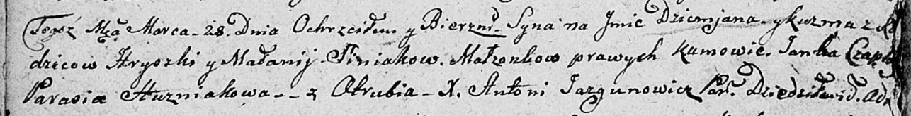

**Синяк Демьян Грыгоров (Siniak Dzemjan Kuźma)**

28 марта 1807 г -- крещение (НИАБ 136-13-894, лист 62об, №20/1807-р
(ориг)).

**НИАБ 136-13-894:** Лист 62об. **Метрическая запись №20/1807-р
(ориг).**

{width="6.496527777777778in"
height="0.8334383202099738in"}

Дедиловичская Покровская церковь. 28 марта 1807 года. Метрическая запись
о крещении.

Siniak Dzemjan Kuźma -- сын родителей с деревни Отруб.

Siniak Hryszka -- отец.

Siniakowa Małanija -- мать.

Czaplay Janka -- кум.

Huzniakowa Parasia -- кума.

Jazgunowicz Antoni -- ксёндз.
