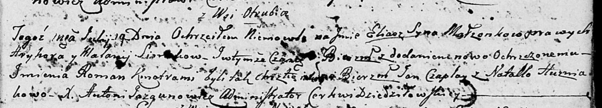

**Синяк Илья Грыгоров (Siniak Eliasz Roman)**

19 июля 1803 г -- крещение (НИАБ 136-13-894, лист 51, №27/1803-р
(ориг)).

**НИАБ 136-13-894:** Лист 51. **Метрическая запись №27/1803-р (ориг).**

{width="6.496527777777778in"
height="1.1740551181102363in"}

Дедиловичская Покровская церковь. 19 июля 1803 года. Метрическая запись
о крещении.

Si\[nia\]k Eliasz Roman -- сын родителей с деревни Отруб.

Si\[nia\]k Hryhor -- отец.

Si\[nia\]kowa Malanija -- мать.

Czaplay Jan -- кум.

Huzniakowa Natalla -- кума.

Jazgunowicz Antoni -- ксёндз.
