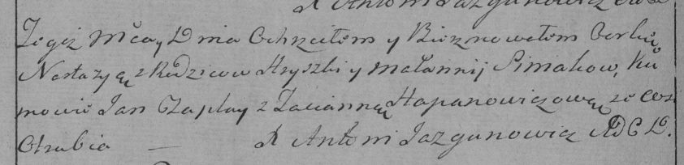

**Синяк Настасья Грыгорова (Siniakowna Nastazyja)**

22 декабря 1791 г -- крещение (НИАБ 136-13-894, лист 14об, №69/1791-р
(ориг)), (РГИА 823-2-18, лист 243об, №37/1791-р (коп)).

**НИАБ 136-13-894:** Лист 14-об. **Метрическая запись №69/1791-р
(ориг).**

{width="6.496527777777778in"
height="0.9313320209973753in"}

Дедиловичская Покровская церковь. 22 декабря 1791 года. Метрическая
запись о крещении.

Siniakowna Nastazyja -- дочь родителей с деревни Отруб.

Siniak Hryszka -- отец.

Siniakowa Małanija -- мать.

Czaplay Jan - кум.

Hapanowiczowa Taciana - кума.

Jazgunowicz Antoni -- ксёндз.

**РГИА 823-2-18:** Лист 243об. **Метрическая запись №37/1791-р (коп).**

{width="6.496527777777778in"
height="1.5743055555555556in"}

Дедиловичская Покровская церковь. 22 декабря 1791 года. Метрическая
запись о крещении.

Siniakowna Nastazya -- дочь родителей с деревни Отруб.

Siniak Hryszka -- отец.

Siniakowna Małannija -- мать.

Czaplay Jan -- кум.

Hapanowiczowa Tacianna - кума.

Jazgunowicz Antoni -- ксёндз.
