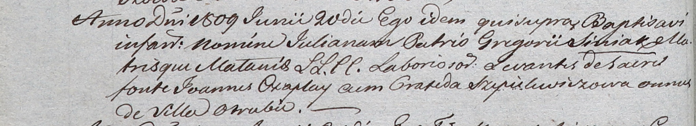

**Синяк Юльяна Грыгорова (Siniakowna Juliana)**

20 июня 1809 г -- крещение (НИАБ 937-4-32, лист 19об, №17/1809-р).

**НИАБ 937-4-32:** Лист 19об. **Метрическая запись №17/1809-р.**

Дедиловичский костел Наисвятейшего Сердца Иисуса. 20 июня 1809 года.
Метрическая запись о крещении.

Siniakowna Juliana -- дочь крестьян с деревни Отруб.

Siniak Gregori -- отец.

Siniakowa Małania -- мать.

Czaplay Joann -- крестный отец, с деревни Отруб.

Szepielewiczowa Praxeda -- крестная мать, с деревни Отруб.

Miszkun Marcus -- ксёндз.
