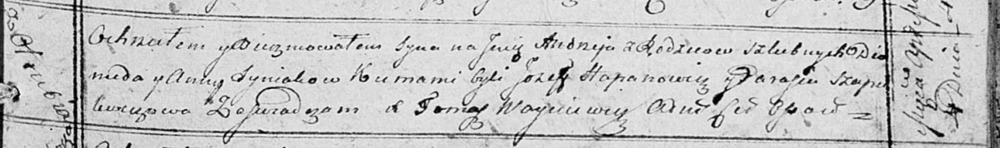

**Синяк Андрей Демьянов (Syniak Andrzey)**

4 апреля 1815 г -- крещение (НИАБ 136-13-894, лист 92, №20/1815-р
(ориг)).

**НИАБ 136-13-894:** Лист 92. **Метрическая запись №20/1815-р (ориг).**

{width="6.496527777777778in"
height="0.9621751968503937in"}

Осовская Покровская церковь. 4 апреля 1815 года. Метрическая запись о
крещении.

Syniak Andrzey -- сын родителей с деревни Отруб.

Syniak Diomid -- отец.

Syniakowa Anna -- мать.

Hapanowicz Jozef -- кум.

Szapialewiczowa Parasia -- кума.

Woyniewicz Tomasz -- ксёндз.
