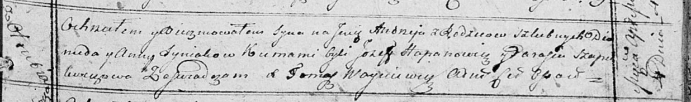

**Синяк Демьян, Диомид (Syniak Dziemjan, Diomid)**

16 июня 1812 г -- крещение дочери Юстыны (НИАБ 136-13-894, лист 84об,
№28/1812-р (ориг)).

4 апреля 1815 г -- крещение сына Андрея (НИАБ 136-13-894, лист 92,
№20/1815-р (ориг)).

**НИАБ 136-13-894:** Лист 84об. **Метрическая запись №28/1812-р
(ориг).**

{width="6.496527777777778in"
height="0.872998687664042in"}

Осовская Покровская церковь. 16 июня 1812 года. Метрическая запись о
крещении.

Syniakowna Justyna -- дочь родителей с деревни Отруб.

Syniak Dziemjan -- отец.

Syniakowa Anna -- мать.

Czapłay Karp -- кум.

Szapielewiczowa Parasia -- кума.

Woyniewicz Tomasz -- ксёндз.

**НИАБ 136-13-894:** Лист 92. **Метрическая запись №20/1815-р (ориг).**

{width="6.496527777777778in"
height="0.9621751968503937in"}

Осовская Покровская церковь. 4 апреля 1815 года. Метрическая запись о
крещении.

Syniak Andrzey -- сын родителей с деревни Отруб.

Syniak Diomid -- отец.

Syniakowa Anna -- мать.

Hapanowicz Jozef -- кум.

Szapialewiczowa Parasia -- кума.

Woyniewicz Tomasz -- ксёндз.
