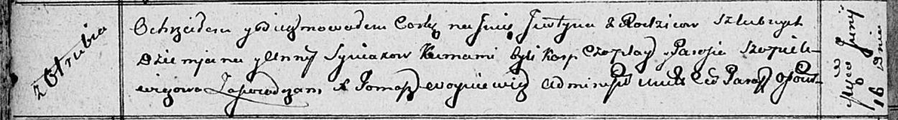

**Синяк Юстына Демьянова (Syniakowna Justyna)**

16 июня 1812 г -- крещение (НИАБ 136-13-894, лист 84об, №28/1812-р
(ориг)).

**НИАБ 136-13-894:** Лист 84об. **Метрическая запись №28/1812-р
(ориг).**

{width="6.496527777777778in"
height="0.872998687664042in"}

Осовская Покровская церковь. 16 июня 1812 года. Метрическая запись о
крещении.

Syniakowna Justyna -- дочь родителей с деревни Отруб.

Syniak Dziemjan -- отец.

Syniakowa Anna -- мать.

Czapłay Karp -- кум.

Szapielewiczowa Parasia -- кума.

Woyniewicz Tomasz -- ксёндз.
