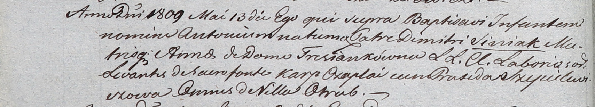

**Синяк Дмитрий (Siniak Dimitri)**

13 мая 1809 г -- крещение сына Антона (НИАБ 937-4-32, лист 19об,
№16/1809-р).

**НИАБ 937-4-32:** Лист 19об. **Метрическая запись №16/1809-р.**

Дедиловичский костел Наисвятейшего Сердца Иисуса. 13 мая 1809 года.
Метрическая запись о крещении.

Siniak Antoni -- сын крестьян с деревни Отруб.

Siniak Dimitri -- отец.

Siniakowa Anna z Tresianków -- мать.

Czaplai Karp -- крестный отец, с деревни Отруб.

Szepelewiczowa Praxeda -- крестная мать, с деревни Отруб.

Miszkun Marcus -- ксёндз.
