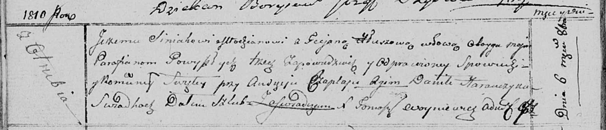
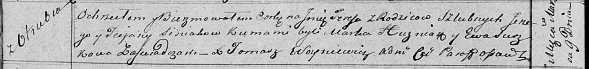
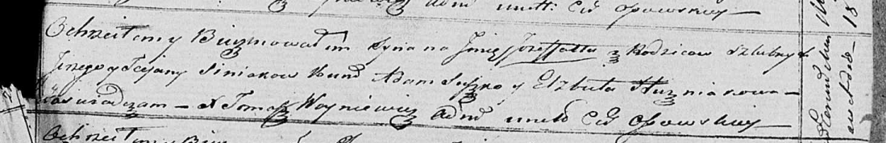

**Синяк Татьяна (Siniakowa Taciana)**

6 октября 1810 г -- венчание с молодым Юрием Синяком с деревни Отруб
(НИАБ 136-13-920, лист 16об, №4/1810-б (ориг)).

9 марта 1819 г -- крещение дочери Тересы (НИАБ 136-13-894, лист 100об,
№12/1819-р (ориг)).

18 сентября 1821 г -- крещение сына Ёзефата (НИАБ 136-13-894, лист 107,
№45/1822-р (ориг)).

**НИАБ 136-13-920:** Лист 16об. **Метрическая запись №4/1810-б (ориг).**

Осовская Покровская церковь. 6 октября 1810 года. Метрическая запись о
венчании.

Siniak Jerzy -- жених, молодой, с деревни Отруб.

Hłuszowa Taciana -- невеста, вдова.

Czaplay Audzey -- свидетель.

Harawczyk Daniła -- свидетель.

Woyniewicz Tomasz -- ксёндз.

**НИАБ 136-13-894:** Лист 100об. **Метрическая запись №12/1819-р
(ориг).**

Осовская Покровская церковь. 9 марта 1819 года. Метрическая запись о
крещении.

Siniakowna Teresa -- дочь родителей с деревни Отруб.

Siniak Jerzy -- отец.

Siniakowa Taciana -- мать.

Huzniak Markо -- кум.

Suszkowa Ewa -- кума.

Woyniewicz Tomasz -- ксёндз.

**НИАБ 136-13-894:** Лист 107. **Метрическая запись №45/1821-р (ориг).**

Осовская Покровская церковь. 18 сентября 1821 года. Метрическая запись о
крещении.

Siniak Jozefat -- сын родителей с деревни \[Отруб\].

Siniak Jerzy -- отец.

Siniakowa Tacjana -- мать.

Suszko Adam -- кум.

Huzniakowa Elżbieta -- кума.

Woyniewicz Tomasz -- ксёндз.
