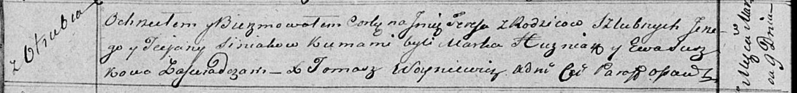

**Синяк Тереса Юрьева (Siniakowna Teresa)**

9 марта 1819 г -- крещение (НИАБ 136-13-894, лист 100об, №12/1819-р
(ориг)).

**НИАБ 136-13-894:** Лист 100об. **Метрическая запись №12/1819-р
(ориг).**

Осовская Покровская церковь. 9 марта 1819 года. Метрическая запись о
крещении.

Siniakowna Teresa -- дочь родителей с деревни Отруб.

Siniak Jerzy -- отец.

Siniakowa Taciana -- мать.

Huzniak Markо -- кум.

Suszkowa Ewa -- кума.

Woyniewicz Tomasz -- ксёндз.
