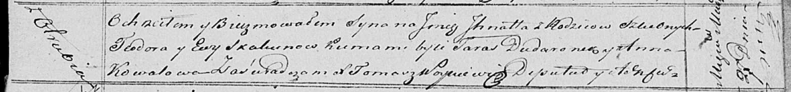

**Скакун Тодор (Skakun Teodor)**

27 марта 1821 г -- крещение сына Игната (НИАБ 136-13-894, лист 106,
№18/1812-р (ориг)).

**НИАБ 136-13-894:** Лист 106. **Метрическая запись №18/1821-р (ориг).**

Осовская Покровская церковь. 27 марта 1821 года. Метрическая запись о
крещении.

Skakun Jhnat -- сын родителей с деревни Отруб.

Skakun Teodor -- отец.

Skakunowa Ewa -- мать.

Dudaronek Taras -- кум.

Kowalowa Anna -- кума.

Woyniewicz Tomasz -- ксёндз.
