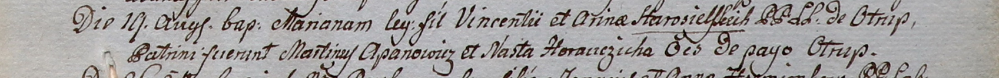

**Старосельский Винцентий (Staroselski Vincenti)**

19 августа 1800 г -- крещение дочери Марьяны (НИАБ 937-4-32, лист 2,
№26/1800-р).

**НИАБ 937-4-32:** Лист 2. **Метрическая запись №26/1800-р.**

Дедиловичский костел Наисвятейшего Сердца Иисуса. 19 августа 1800 года.
Метрическая запись о крещении.

{width="6.496527777777778in"
height="0.5131944444444444in"}

Starosielska Mariana -- дочь крестьян с деревни Отруб.

Starosielski Vincenti -- отец.

Starosielska Arina -- мать.

Apanowicz Martinusz -- крестный отец, с деревни Отруб.

Horauczicha Nasta -- крестная мать, с деревни Отруб.

Linhart Hyacinthus -- ксёндз.
