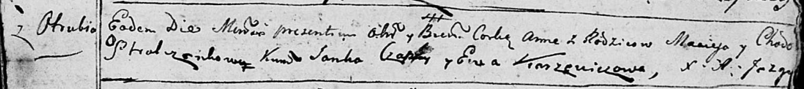

**Стрельчёнок Анна Мацеева (Stralczonkowna Anna)**

30 мая 1792 г -- крещение (НИАБ 136-13-894, лист 16, №31/1792-р (ориг)).

**НИАБ 136-13-894:** Лист 16. **Метрическая запись №31/1792-р (ориг).**

{width="6.496527777777778in"
height="0.7241458880139983in"}

Дедиловичская Покровская церковь. 30 мая 1792 года. Метрическая запись о
крещении.

Stralczonkowna Anna -- дочь родителей с деревни Отруб.

Stralczonek Maciey -- отец.

Stralczonkowa Chodora -- мать.

Czaplay Janka - кум.

Karżewiczowa Ewa - кума.

Jazgunowicz Antoni -- ксёндз.
