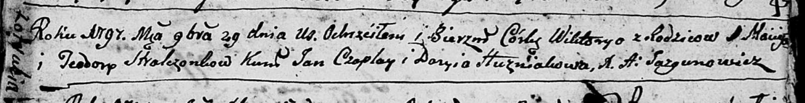
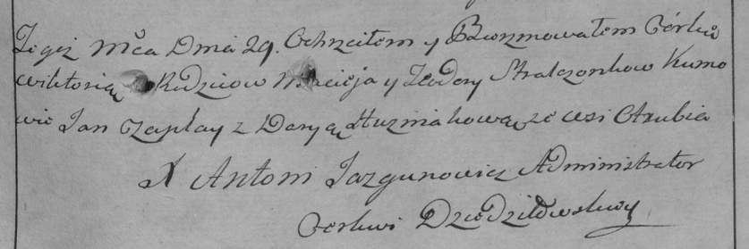

**Стрельчёнок Викторыя Мацеева (Stralczonkowna Wiktoryia)**

29 ноября 1797 г -- крещение (НИАБ 136-13-894, лист 35, №66/1797-р
(ориг)), (РГИА 823-2-18, лист 261, №47/1797-р (коп)).

**НИАБ 136-13-894:** Лист 35. **Метрическая запись №66/1797-р (ориг).**

Дедиловичская Покровская церковь. 29 ноября 1797 года. Метрическая
запись о крещении.

Stralczonkowna Wiktoryia -- дочь родителей с деревни Отруб.

Stralczonek Maciey -- отец.

Stralczonkowa Teodora -- мать.

Czaplay Jan - кум.

Huzniakowa Daryia - кума.

Jazgunowicz Antoni -- ксёндз.

**РГИА 823-2-18:** Лист 261. **Метрическая запись №47/1797-р (коп).**

Дедиловичская Покровская церковь. 29 ноября 1797 года. Метрическая
запись о крещении.

Stralczonkowna Wiktorya -- дочь родителей с деревни Отруб.

Stralczonek Maciey -- отец.

Stralczonkowa Teodora -- мать.

Czaplay Jan -- кум.

Huzniakowa Darya -- кума.

Jazgunowicz Antoni -- ксёндз.
